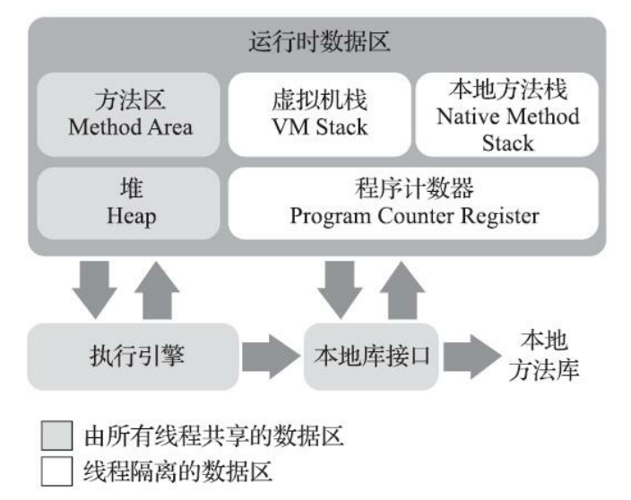

Java虚拟机学习的整理与总结。

---

<!--more-->

## 自动内存管理

根据《Java虚拟机规范》的规定，Java虚拟机所管理的内存包含下图中所示的几个运行时数据区域：

### 内存区域

1. 程序计数器

1. 虚拟机栈

1. 本地方法栈

1. 堆

1. 方法区

1. 运行时常量池

### 内存对象

### 自动内存分配

### 自动内存回收

### 性能监控及故障处理工具

### 调优

## 执行子系统

### 类文件结构

### 类加载机制
